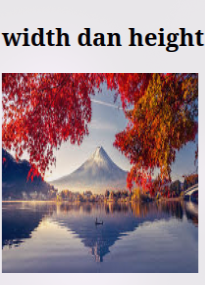

# Praktikum Pemograman WEB-1

## HTML

HTML adalah kepanjangan dari **Hyper Text Markup Language**, markup language adalah bahasa komputer yang menggunakan tags atau tanda yang akan diterjemahkan komputer menjadi sebuah tampilan web.

### Struktur HTML


- &lt;!DOCTYPE html&gt;: deklarasi yang menadakan bahwa dokumen ini adalah HTML5.
- &lt;html&gt; : akar(root) dari halaman HTML.
- &lt;head&gt; : berisi informasi meta mengenai halaman HTML.
- &lt;body&gt; : container dari semua konten yang dapat dilihat seperti, heading, paragraphs, images, hyperlinks, tables, lists, dll.

Tidak semua HTML mempunyai content dan end tag, seperti &lt;br&gt;. Elements yang tidak mempunyai content sidebut empty elements.

## Basic HTML

### HTML Heading

HTML heading menggunakan tag dari &lt;h1&gt;(terbesar) sampai yang &lt;h6&gt;(terkecil)


### HTML Paragraphs

HTML paragraphs menggunakan tag &lt;p&gt;


### HTML Links

HTML link mengunakan tag &lt;a&gt; dengan atribut href untuk link destinasi.


### HTML Images

HTML Images mengunakan tag &lt;img&gt;, dan memiliki atribut src(source file), alt(alternative text), width(lebar) dan height(panjang).


## HTML Elements

HTML element terdiri dari start tag, content, dan end tag.

```
<startTag> Content </endTag>
```

```
<h1>Heading</h1>
```

```
<p>Paragraph</p>
```

**&lt;h1&gt; Heading &lt;/h1&gt;**

**&lt;p&gt; paragraph &lt;/p&gt;**

### Nested element

Nested element atau element bersarang artinya elemen dapat berisi elemen lain. Contoh nya seperti elemen &lt;body&gt; yang berisi elemen-elemen lain yang akan ditampilkan pad website, seperti &lt;p&gt; dan &lt;h1&gt;.

## HTML Attributes

- Semua HTML element bisa memiliki attributes.
- Attributes memberikan informasi tambahan mengenai elemetnts.
- Attributes selalu diletakan pada start tag.
- Attributes biasanya menggunakan value seperti name="value".

### Contoh Attributes

#### 1. href

href adalah attribut yang digunakan pada element &lt;a&gt;.menentukan URL halaman yang dituju tautannya.


#### 2. src

src attribut yang digunakan pada element &lt;img&gt; menentukan parh ke gambar yang akan ditampilkan .

ada dua cara untuk menentukan URL pada src attribute:

1. Absosulte URL:
   Tautan ke gambar eksternal yang dihosting di situs web lain. Contoh: src="https://www.w3schools.com/images/img_girl.jpg".

   

2. Relative URL: Tautan ke gambar yang di-host di dalam situs web. Di sini, URL tidak menyertakan nama domain. Jika URL dimulai tanpa garis miring, URL akan relatif terhadap halaman saat ini. Contoh: src="img_girl.jpg". Jika URL dimulai dengan garis miring, maka akan relatif terhadap domain. Contoh: src = "/images/img_girl.jpg".
   

   

#### 3. width dan height

width dan height digunakan pada tag &lt;img&gt; untuk menentukan ukuran lebar dan panjang gambar.




#### 4. style

Atribut style digunakan untuk menambahkan gaya ke
elemen, seperti warna, font, ukuran, dan lainnya.


## 5. HTML Formatting

HTML berisi beberapa elemen untuk mendefinisikan teks dengan makna khusus.

### HTML formatting ellements

- &lt;b&gt; - Bold text

```
<b>bold text</b>
```

- &lt;strong&gt; - Important text

```
<strong>strong text</strong>
```

- &lt;i&gt; - Italic text

```
<i>italic text</i>
```

- &lt;em&gt; - Marked text

```
<mark>mark text</mark>
```

- &lt;mark&gt; - Smaller text

```
<small>small text</small>
```

- &lt;small&gt; - Deleted text

```
<del>del text</del>
```

- &lt;ins&gt; - Inserted text

```
<p><ins>ins text</ins></p>
```

- &lt;sub&gt; - Subscript text

```
<sub>sub text</sub>
```

<sub>sub text</sub>

```
- &lt;sup&gt; - Superscript text
```

<sup>sup text</sup>

```
<sup>sup text</sup>
```


## HTMl Colors

Warna HTML ditentukan dengan nama warna yang sudah ditentukan sebelumnya, atau dengan nilai RGB, HEX, HSL, RGBA, atau HSLA.

### 1. Color Name

Dalam HTML warna sudah ditentukan dengan nama warna.

```
        <h1 style="background-color: Tomato">Tomato</h1>
        <h1 style="background-color: Orange">Orange</h1>
        <h1 style="background-color: DodgerBlue">DodgerBlue</h1>
        <h1 style="background-color: MediumSeaGreen">MediumSeaGreen</h1>
        <h1 style="background-color: Gray">Gray</h1>
        <h1 style="background-color: SlateBlue">SlateBlue</h1>
        <h1 style="background-color: Violet">Violet</h1>
        <h1 style="background-color: LightGray">LightGray</h1>

```


### 2. RGB dan RGBA

- RGB

  **rgb (red, green, blue)**

  Tiap parameter (merah, hijau, dan biru) mendefinisikan intensitas warna dengan nilai antara 0 dan 255. Dengan 16777216(255 x 255 x 255) kemungkinan warna.

```
  <h1 style="background-color: rgb(255, 0, 0)">rgb(255, 0, 0)</h1>
    <h1 style="background-color: rgb(0, 0, 255)">rgb(0, 0, 255)</h1>
    <h1 style="background-color: rgb(60, 179, 113)">rgb(60, 179, 113)</h1>
    <h1 style="background-color: rgb(238, 130, 238)">rgb(238, 130, 238)</h1>
    <h1 style="background-color: rgb(255, 165, 0)">rgb(255, 165, 0)</h1>
    <h1 style="background-color: rgb(106, 90, 205)">rgb(106, 90, 205)</h1>

```


- RGBA

  **rgba (red, green, blue, alpha)**

RGBA adalah extensi dari RGB dengan tambahab Alpha channel yang merupakan opacity dari warna

```
  <h1 style="background-color: rgba(255, 99, 71, 0)">rgba(255, 99, 71, 0)</h1>
    <h1 style="background-color: rgba(255, 99, 71, 0.2)">
      rgba(255, 99, 71, 0.2)
    </h1>
    <h1 style="background-color: rgba(255, 99, 71, 0.4)">
      rgba(255, 99, 71, 0.4)
    </h1>
    <h1 style="background-color: rgba(255, 99, 71, 0.6)">
      rgba(255, 99, 71, 0.6)
    </h1>
    <h1 style="background-color: rgba(255, 99, 71, 0.8)">
      rgba(255, 99, 71, 0.8)
    </h1>
    <h1 style="background-color: rgba(255, 99, 71, 1)">rgba(255, 99, 71, 1)</h1>

```


### 3. hex(Hexadecimal)

Warna heksadesimal ditentukan dengan: #RRGGBB, di mana bilangan bulat heksadesimal RR (merah), GG (hijau) dan BB (biru) menentukan komponen warna.

```
    <h1 style="background-color: #ff0000">#ff0000</h1>
    <h1 style="background-color: #0000ff">#0000ff</h1>
    <h1 style="background-color: #3cb371">#3cb371</h1>
    <h1 style="background-color: #ee82ee">#ee82ee</h1>
    <h1 style="background-color: #ffa500">#ffa500</h1>
    <h1 style="background-color: #6a5acd">#6a5acd</h1>

```


### 4. hsl dan hsla

hsl merupakan kepanjangan dari hue(rona warna), saturation(saturasi), lightnes(kecerahan).

hsla merupkan ekstensi dari hsla dengan tambahan Alpha channel yang merupakan opacity dari warna.

**hsl(hue, saturation, lightness, alpha)**

- hsl

**hsl(hue, saturation, lightness)**

```
   <h1 style="background-color: hsl(0, 100%, 50%)">hsl(0, 100%, 50%)</h1>
    <h1 style="background-color: hsl(240, 100%, 50%)">hsl(240, 100%,w 50%)</h1>
    <h1 style="background-color: hsl(147, 50%, 47%)">hsl(147, 50%, 47%)</h1>
    <h1 style="background-color: hsl(300, 76%, 72%)">hsl(300, 76%, 72%)</h1>
    <h1 style="background-color: hsl(39, 100%, 50%)">hsl(39, 100%, 50%)</h1>
    <h1 style="background-color: hsl(248, 53%, 58%)">hsl(248, 53%, 58%)</h1>

```


- hsla

**hsl(hue, saturation, lightness, alpha)**

```
<h1 style="background-color:hsla(9, 100%, 64%, 0);">hsla(9, 100%, 64%, 0)</h1>
<h1 style="background-color:hsla(9, 100%, 64%, 0.2);">hsla(9, 100%, 64%, 0.2)</h1>
<h1 style="background-color:hsla(9, 100%, 64%, 0.4);">hsla(9, 100%, 64%, 0.4)</h1>
<h1 style="background-color:hsla(9, 100%, 64%, 0.6);">hsla(9, 100%, 64%, 0.6)</h1>
<h1 style="background-color:hsla(9, 100%, 64%, 0.8);">hsla(9, 100%, 64%, 0.8)</h1>
<h1 style="background-color:hsla(9, 100%, 64%, 1);">hsla(9, 100%, 64%, 1)</h1>

```


