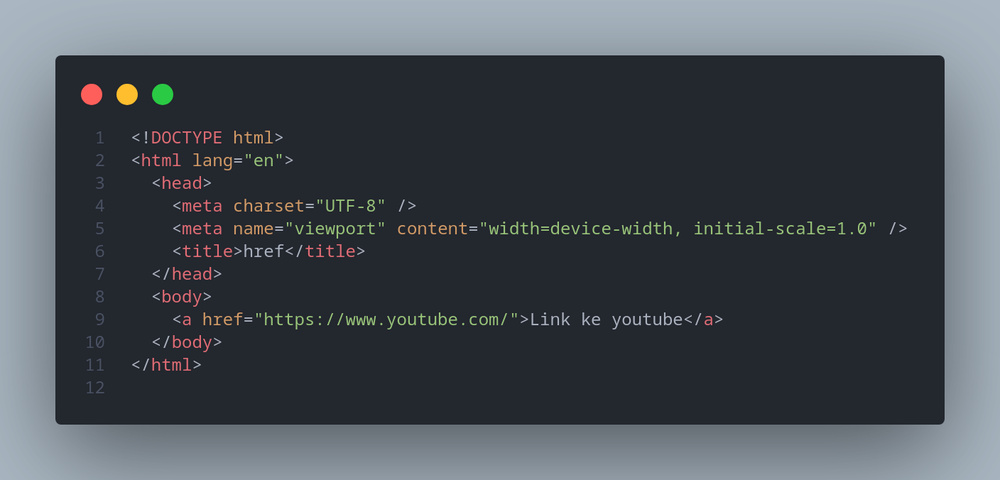

# Praktikum Pemograman WEB-1

## HTML

HTML adalah kepanjangan dari **Hyper Text Markup Language**, markup language adalah bahasa komputer yang menggunakan tags atau tanda yang akan diterjemahkan komputer menjadi sebuah tampilan web.

### Struktur HTML


- &lt;!DOCTYPE html&gt;: deklarasi yang menadakan bahwa dokumen ini adalah HTML5.
- &lt;html&gt; : akar(root) dari halaman HTML.
- &lt;head&gt; : berisi informasi meta mengenai halaman HTML.
- &lt;body&gt; : container dari semua konten yang dapat dilihat seperti, heading, paragraphs, images, hyperlinks, tables, lists, dll.

Tidak semua HTML mempunyai content dan end tag, seperti &lt;br&gt;. Elements yang tidak mempunyai content sidebut empty elements.

## Basic HTML

### HTML Heading

HTML heading menggunakan tag dari &lt;h1&gt;(terbesar) sampai yang &lt;h6&gt;(terkecil)


### HTML Paragraphs

HTML paragraphs menggunakan tag &lt;p&gt;


### HTML Links

HTML link mengunakan tag &lt;a&gt; dengan atribut href untuk link destinasi.


### HTML Images

HTML Images mengunakan tag &lt;img&gt;, dan memiliki atribut src(source file), alt(alternative text), width(lebar) dan height(panjang).


## HTML Elements

HTML element terdiri dari start tag, content, dan end tag.

```
<startTag> Content </endTag>
```

```
<h1>Heading</h1>
```

```
<p>Paragraph</p>
```

**&lt;h1&gt; Heading &lt;/h1&gt;**

**&lt;p&gt; paragraph &lt;/p&gt;**

### Nested element

Nested element atau element bersarang artinya elemen dapat berisi elemen lain. Contoh nya seperti elemen &lt;body&gt; yang berisi elemen-elemen lain yang akan ditampilkan pad website, seperti &lt;p&gt; dan &lt;h1&gt;.

## HTML Attributes

- Semua HTML element bisa memiliki attributes.
- Attributes memberikan informasi tambahan mengenai elemetnts.
- Attributes selalu diletakan pada start tag.
- Attributes biasanya menggunakan value seperti name="value".

### Contoh Attributes

#### 1. href

href adalah attribut yang digunakan pada element &lt;a&gt;.menentukan URL halaman yang dituju tautannya.


#### 2. src

src attribut yang digunakan pada element &lt;img&gt; menentukan parh ke gambar yang akan ditampilkan .

ada dua cara untuk menentukan URL pada src attribute:

1. Absosulte URL:
   Tautan ke gambar eksternal yang dihosting di situs web lain. Contoh: src="https://www.w3schools.com/images/img_girl.jpg".

   

2. Relative URL: Tautan ke gambar yang di-host di dalam situs web. Di sini, URL tidak menyertakan nama domain. Jika URL dimulai tanpa garis miring, URL akan relatif terhadap halaman saat ini. Contoh: src="img_girl.jpg". Jika URL dimulai dengan garis miring, maka akan relatif terhadap domain. Contoh: src = "/images/img_girl.jpg".
   

   

#### 3. width dan height

width dan height digunakan pada tag &lt;img&gt; untuk menentukan ukuran lebar dan panjang gambar.


#### 4. style

Atribut style digunakan untuk menambahkan gaya ke
elemen, seperti warna, font, ukuran, dan lainnya.


## 5. HTML Formatting

HTML berisi beberapa elemen untuk mendefinisikan teks dengan makna khusus.

### HTML formatting ellements

- &lt;b&gt; - Bold text

```
<b>bold text</b>
```

- &lt;strong&gt; - Important text

```
<strong>strong text</strong>
```

- &lt;i&gt; - Italic text

```
<i>italic text</i>
```

- &lt;em&gt; - Marked text

```
<mark>mark text</mark>
```

- &lt;mark&gt; - Smaller text

```
<small>small text</small>
```

- &lt;small&gt; - Deleted text

```
<del>del text</del>
```

- &lt;ins&gt; - Inserted text

```
<p><ins>ins text</ins></p>
```

- &lt;sub&gt; - Subscript text

```
<sub>sub text</sub>
```

<sub>sub text</sub>

```
- &lt;sup&gt; - Superscript text
```

<sup>sup text</sup>

```
<sup>sup text</sup>
```


## HTML Quotation and Citation Elements

element HTML yang digunakan untuk mengutip.

&lt;blockquote&gt; - Mendefinisikan bagian yang dikutip dari sumber lain

```
  <blockquote cite="http://www.worldwildlife.org/who/index.html">
      For 60 years, WWF has worked to help people and nature thrive. As the
      world's leading conservation organization, WWF works in nearly 100
      countries. At every level, we collaborate with people around the world to
      develop and deliver innovative solutions that protect communities,
      wildlife, and the places in which they live.
    </blockquote>
```

&lt;q&gt; - Mengutip teks menggunakan (" ")

```
  <p>WWF's goal is to: <q>Build a future where people live in harmony with nature.</q></p>


```

&lt;abbr&gt; - Mendefinisikan singkatan atau akronim

```
<p>The <abbr title="World Health Organization">WHO</abbr> was founded in 1948.</p>


```

&lt;address&gt; - informasi kontak untuk penulis/pemilik dokumen

```
  <address>
      Written by John Doe.<br />
      Visit us at:<br />
      Example.com<br />
      Box 564, Disneyland<br />
      USA
    </address>
```

&lt;cite&gt; - informasi kontak untuk penulis/pemilik dokumen

```
   <p><cite>The Scream</cite> by Edvard Munch. Painted in 1893.</p>
```

&lt;bdo&gt; - menulis teks dari kanan ke kiri

```
    <bdo dir="rtl">This text will be written from right to left</bdo>
```


## HTML Comment

HTML bisa menuliskan komen dengan menggunakan syntax:

```
<!-- tulis komen disini --!>
```

komen tidak akan ditampilkan pada halaman web.

## HTMl Colors

Warna HTML ditentukan dengan nama warna yang sudah ditentukan sebelumnya, atau dengan nilai RGB, HEX, HSL, RGBA, atau HSLA.

### 1. Color Name

Dalam HTML warna sudah ditentukan dengan nama warna.

```
        <h1 style="background-color: Tomato">Tomato</h1>
        <h1 style="background-color: Orange">Orange</h1>
        <h1 style="background-color: DodgerBlue">DodgerBlue</h1>
        <h1 style="background-color: MediumSeaGreen">MediumSeaGreen</h1>
        <h1 style="background-color: Gray">Gray</h1>
        <h1 style="background-color: SlateBlue">SlateBlue</h1>
        <h1 style="background-color: Violet">Violet</h1>
        <h1 style="background-color: LightGray">LightGray</h1>

```


### 2. RGB dan RGBA

- RGB

  **rgb (red, green, blue)**

  Tiap parameter (merah, hijau, dan biru) mendefinisikan intensitas warna dengan nilai antara 0 dan 255. Dengan 16777216(255 x 255 x 255) kemungkinan warna.

```
  <h1 style="background-color: rgb(255, 0, 0)">rgb(255, 0, 0)</h1>
    <h1 style="background-color: rgb(0, 0, 255)">rgb(0, 0, 255)</h1>
    <h1 style="background-color: rgb(60, 179, 113)">rgb(60, 179, 113)</h1>
    <h1 style="background-color: rgb(238, 130, 238)">rgb(238, 130, 238)</h1>
    <h1 style="background-color: rgb(255, 165, 0)">rgb(255, 165, 0)</h1>
    <h1 style="background-color: rgb(106, 90, 205)">rgb(106, 90, 205)</h1>

```


- RGBA

  **rgba (red, green, blue, alpha)**

RGBA adalah extensi dari RGB dengan tambahan Alpha channel yang merupakan opacity dari warna

```
  <h1 style="background-color: rgba(255, 99, 71, 0)">rgba(255, 99, 71, 0)</h1>
    <h1 style="background-color: rgba(255, 99, 71, 0.2)">
      rgba(255, 99, 71, 0.2)
    </h1>
    <h1 style="background-color: rgba(255, 99, 71, 0.4)">
      rgba(255, 99, 71, 0.4)
    </h1>
    <h1 style="background-color: rgba(255, 99, 71, 0.6)">
      rgba(255, 99, 71, 0.6)
    </h1>
    <h1 style="background-color: rgba(255, 99, 71, 0.8)">
      rgba(255, 99, 71, 0.8)
    </h1>
    <h1 style="background-color: rgba(255, 99, 71, 1)">rgba(255, 99, 71, 1)</h1>

```


### 3. hex(Hexadecimal)

Warna heksadesimal ditentukan dengan: #RRGGBB, di mana bilangan bulat heksadesimal RR (merah), GG (hijau) dan BB (biru) menentukan komponen warna.

```
    <h1 style="background-color: #ff0000">#ff0000</h1>
    <h1 style="background-color: #0000ff">#0000ff</h1>
    <h1 style="background-color: #3cb371">#3cb371</h1>
    <h1 style="background-color: #ee82ee">#ee82ee</h1>
    <h1 style="background-color: #ffa500">#ffa500</h1>
    <h1 style="background-color: #6a5acd">#6a5acd</h1>

```


### 4. hsl dan hsla

hsl merupakan kepanjangan dari hue(rona warna), saturation(saturasi), lightnes(kecerahan).

hsla merupkan ekstensi dari hsla dengan tambahan Alpha channel yang merupakan opacity dari warna.

- hsl

**hsl(hue, saturation, lightness)**

```
   <h1 style="background-color: hsl(0, 100%, 50%)">hsl(0, 100%, 50%)</h1>
    <h1 style="background-color: hsl(240, 100%, 50%)">hsl(240, 100%,w 50%)</h1>
    <h1 style="background-color: hsl(147, 50%, 47%)">hsl(147, 50%, 47%)</h1>
    <h1 style="background-color: hsl(300, 76%, 72%)">hsl(300, 76%, 72%)</h1>
    <h1 style="background-color: hsl(39, 100%, 50%)">hsl(39, 100%, 50%)</h1>
    <h1 style="background-color: hsl(248, 53%, 58%)">hsl(248, 53%, 58%)</h1>

```


- hsla

**hsl(hue, saturation, lightness, alpha)**

```
<h1 style="background-color:hsla(9, 100%, 64%, 0);">hsla(9, 100%, 64%, 0)</h1>
<h1 style="background-color:hsla(9, 100%, 64%, 0.2);">hsla(9, 100%, 64%, 0.2)</h1>
<h1 style="background-color:hsla(9, 100%, 64%, 0.4);">hsla(9, 100%, 64%, 0.4)</h1>
<h1 style="background-color:hsla(9, 100%, 64%, 0.6);">hsla(9, 100%, 64%, 0.6)</h1>
<h1 style="background-color:hsla(9, 100%, 64%, 0.8);">hsla(9, 100%, 64%, 0.8)</h1>
<h1 style="background-color:hsla(9, 100%, 64%, 1);">hsla(9, 100%, 64%, 1)</h1>

```


## HTML tables

HTML table element:

- &lt;tr&gt; - Setiap baris table dimulai menggunakan &lt;tr&gt; diakhiri &lt;/tr&gt;.
- &lt;td&gt; - table cell mengunakan &lt;td&gt; diakhiri &lt;/td&gt;.
- &lt;th&gt; - digunakan untuk table header &lt;td&gt; diakhiri &lt;/td&gt;.

HTML table attribut:

- rowspan - untuk merge baris cell
- colspan - untuk merge kolum cell

```
<!DOCTYPE html>
<html lang="en">
  <head>
    <meta charset="UTF-8" />
    <meta name="viewport" content="width=device-width, initial-scale=1.0" />
    <title>table</title>
  </head>
  <style>
    table {
      border-collapse: collapse;
    }
    tr,
    th,
    td {
      border: 2px solid black;
    }
  </style>
  <body>
    <table>
      <tr>
        <th>Nama</th>
        <th>Jurusan</th>
        <th>Kelas</th>
        <th colspan="2">Universitas</th>
      </tr>
      <tr>
        <td>Arya</td>
        <td>D3 Teknik Informatika</td>
        <td>TI-C</td>
        <td rowspan="3">PNC</td>
        <td rowspan="3">
          
        </td>
      </tr>
      <tr>
        <td>Budi</td>
        <td>D4 Teknik Pencegahan Pencemaran Lingkungan</td>
        <td>TPPL-A</td>
      </tr>
      <tr>
        <td>Agus</td>
        <td>D3 Teknik Mesin</td>
        <td>TM-B</td>
      </tr>
    </table>
  </body>
</html>
&lt;tr&gt;
```

hasil:


## HTML Lists

HMTL List dibagi menjadi dua yaitu unordered dan ordered list:

### Unordered List

Unordered list menggunakan tag &lt;ul&gt; yang di dalam nya berisi tag &lt;li&gt;. Item yang dilist akan ditandai dengan bullets secara deffault dan bisa diganti menggunakan attribute type.

value attribut type yang bisa digunakan pada tag &lt;ul&gt; :

1. disk - merubah marker menjadi bullets
2. circle - merubah marker menjadi circle
3. square - merubah marker menjadi square
4. none - list item tidak di mark

```
   <h1>Daftar buah</h1>
    <!-- disc -->
    <h2>disc(default)</h2>
    <ul>
      <li>Apel</li>
      <li>Jeruk</li>
      <li>Pisang</li>
    </ul>
    <!-- circle -->
    <h2>circle</h2>
    <ul type="circle">
      <li>Apel</li>
      <li>Jeruk</li>
      <li>Pisang</li>
      <li>dll</li>
    </ul>
    <!-- square -->
    <h2>square</h2>
    <ul type="square">
      <li>Apel</li>
      <li>Jeruk</li>
      <li>Pisang</li>
      <li>dll</li>
    </ul>
    <!-- none -->
    <h2>none</h2>
    <ul type="none">
      <li>Apel</li>
      <li>Jeruk</li>
      <li>Pisang</li>
      <li>dll</li>
    </ul>
```


### Ordered List

Unordered list menggunakan tag &lt;ol&gt; yang di dalam nya berisi tag &lt;li&gt;. Item yang dilist akan ditandai dengan number secara default.

value attribut type yang bisa digunakan pada tag &lt;ol&gt; :

1. 1 - List number akan diberi nomor dengan angka.
2. A - List number akan diberi nomor dengan huruf kapital.
3. a - List number akan diberi nomor dengan huruf kecil.
4. I - List number akan diberi nomor dengan angka romawi kapital.
5. i - List number akan diberi nomor dengan angka romawi kecil.

```
 <h3>Daftar buah</h3>
   <h1>Daftar buah</h1>
    <!-- number(1) -->
    <h2>number(default)</h2>
    <ol>
      <li>Apel</li>
      <li>Jeruk</li>
      <li>Pisang</li>
    </ol>
    <!-- uppercase(A) -->
    <h2>uppercase(A)</h2>
    <ol type="A">
      <li>Apel</li>
      <li>Jeruk</li>
      <li>Pisang</li>
      <li>dll</li>
    </ol>
    <!-- lowercase(a) -->
    <h2>square</h2>
    <ol type="a">
      <li>Apel</li>
      <li>Jeruk</li>
      <li>Pisang</li>
      <li>dll</li>
    </ol>
    <!-- uppercase roman number -->
    <h2>angka romawi uppercase(I)</h2>
    <ol type="I">
      <li>Apel</li>
      <li>Jeruk</li>
      <li>Pisang</li>
      <li>dll</li>
    </ol>
    <h2>angka romawi lowercase(i)</h2>
    <ol type="i">
      <li>Apel</li>
      <li>Jeruk</li>
      <li>Pisang</li>
      <li>dll</li>
    </ol>
```


## HTML Block and Inline

Setiap HTMl element HTML mempunyai default display value, terganutung dengan apa tipe element tersebut. Ada dua tipe display value yang umum yaitu block dan inline.

### Block Elements

selalu dimulai pada baris baru, dan browser secara otomatis menambahkan ruang (margin) sebelum dan sesudah elemen. Elemen tingkat blok selalu menggunakan lebar penuh yang tersedia (membentang ke kiri dan kanan sejauh mungkin).

element yang bisanya menggunakan block adalah &lt;div&gt; dan &lt;p&gt;.

### Inline Elements

Inline element tidak membuat baris baru. Inline element hanya menggunakan ruang secukupnya tidak seperti block element.

element yang bisanya menggunakan block adalah &lt;span&gt; dalam paragraf.

## HTML Div

Div element digunakan sebagai container untuk element yang lain.

Dib element secara default adalah block element yang berarti element ini mengambil semua ruang yang tersedia dan membuat baris baru.

Contoh penggunaan div:

```
<!DOCTYPE html>
<html>
  <style>
    div {
      background-color: #fff4a3;
      padding: 3px;
      margin: 16px;
    }
  </style>
  <body>
    <h1>Contoh DIV</h1>

    <div>
      <h2>London</h2>
      <p>London is the capital city of England.</p>
      <p>London has over 13 million inhabitants.</p>
    </div>
    <div>
      <h2>Jakarta</h2>
      <p>Jakarta is the capital city of Indonesia.</p>
      <p>Lorem ipsum dolor sit.</p>
    </div>
  </body>
</html>
```


## HTML class Attribute

class adalah atribut yang digunakan untuk memberikan class pada sebuah element. Element HTMl bisa berbagi class yang sama. class biasa dihunakan untuk selector CSS atau querySellector Javascript.

Contoh penggunaan class untuk selector CSS(menggunkan '.' untuk pemanggilan class pada css):

```
<!DOCTYPE html>
<html>
  <head>
    <style>
      .city {
        color: white;
        border: 2px solid black;
        margin: 20px;
        padding: 20px;
      }
      .london{
        background: darkcyan;
      }
      .paris{
        background: darkgoldenrod;
      }
      .tokyo{
        background: darkmagenta;
      }
    </style>
  </head>
  <body>
    <div class="city london">
      <h2>London</h2>
      <p>London is the capital of England.</p>
    </div>

    <div class="city paris">
      <h2>Paris</h2>
      <p>Paris is the capital of France.</p>
    </div>

    <div class="city tokyo">
      <h2>Tokyo</h2>
      <p>Tokyo is the capital of Japan.</p>
    </div>
  </body>
</html>

```


## HTML id Attrubute

id atribut digunakan untuk memberikan id unik untuk elemen HTML. Elemen HTML tidak bisa berbagi id yang sama berbeda dengan class yang bisa digunakan banyak elemen. id digunkan untuk CSS dan Javascript.

contoh penggunaan id(menggunkan '#' untuk pemanggilan id pada css) :

```
<!DOCTYPE html>
<html>
  <head>
    <style>
        /* menggunkan # untuk memanggil id */
        #title{
            text-align: center;
            background: lightblue;
            padding: 4px;
        }
      .city {
       tomato;
        color: white;
        border: 2px solid black;
        margin: 20px;
        padding: 20px;
      }
      .london{
        background: darkcyan;
      }
      .paris{
        background: darkgoldenrod;
      }
      .tokyo{
        background: darkmagenta;
      }
    </style>
  </head>
  <body>
    <h1 id="title">City</h1>
    <div class="city london">
      <h2>London</h2>
      <p>London is the capital of England.</p>
    </div>

    <div class="city paris">
      <h2>Paris</h2>
      <p>Paris is the capital of France.</p>
    </div>

    <div class="city tokyo">
      <h2>Tokyo</h2>
      <p>Tokyo is the capital of Japan.</p>
    </div>
  </body>
</html>

```


## HTML Iframe

&lt;iframe&gt; digunakan untuk menyematkan dokumen lain seperti web di dalam dokumen HTML saat ini:

```
<!DOCTYPE html>
<html lang="en">
  <head>
    <meta charset="UTF-8" />
    <meta name="viewport" content="width=device-width, initial-scale=1.0" />
    <title>iframe</title>
  </head>
  <body>
    <h1>
      <u><b>iframe</b></u>
    </h1>
    <iframe
      width="738"
      height="415"
      src="https://www.youtube.com/embed/HGTJBPNC-Gw"
      title="HTML &amp; CSS Full Course for free 🌎 (2023)"
      frameborder="0"
      allow="accelerometer; autoplay; clipboard-write; encrypted-media; gyroscope; picture-in-picture; web-share"
      referrerpolicy="strict-origin-when-cross-origin"
      allowfullscreen
    ></iframe>
  </body>
</html>

```


## HTML Layout

Website biasanya menampilkan banyak konten dalam berapa kolom seperti majalah atau koran.

contoh:


### Semantic elements

HTML mempunyai semantic elemen yang menunjukan bagian dari sebuah halaman website:

- &lt;header&gt; - elemen untuk sebuah header web.
- &lt;nav&gt; - elemen untuk sekumpulan tautan navigasi.
- &lt;section&gt; - elemen bagian dalam dokumen
- &lt;article&gt; - elemen untuk bagian konten yang berdiri sendiri dan mandiri.
- &lt;footer&gt; - elemen untuk bagian footer.
- &lt;aside&gt; - elemen untuk bagian konten selain konten seperti bilah sisi.
- &lt;details&gt; - elemen untuk bagian detail tambahan yang dapat dibuka dan ditutup oleh pengguna.
- &lt;summary&gt; - heading untuk elemen detail.


# CSS

CSS adalah kepanjangan dari Cascading Style Sheet.

CSS adalah bahasa komputer yang digunakan untuk memberi style pada HTML document.

## CSS Syntax


Selector menunjuk HTML element yang akan di stke.

Declaration block berisi satu atau lebih deklarasi yang dipisahkan semicolons(;);

Setiap deklrasi menyertakan sebuah CSS property name dan value.

## CSS Selector

Untuk memilih HTML elemen yang akan di style ada beberapa cara yaitu:

1. Selector element = elemen
2. Selector id = #id
3. Selector class = .class
4. Selector universal = \*

- element Selector

```
p{
  color: red;
}
```

Semua elemen &lt;p&gt; pada halaman web akan berwarna merah.

- id Selector

```
#teks{
  color:blue;
}
```

Elemen dengan id teks akan berwarna biru.

- class Selector

```
.teks1{
  color: red;
}
```

semua class teks1 akan berwana merah.

- Universal Selector

```
 * {
  text-align: center;
  color: blue;
}
```

Ini akan berefek pada semua HTML elemen.

- Grouping Selector

```
h1,h2,p{
  color: white;
}
```

## Cara menambahkan CSS

ada tiga cara untuk menyisipkan style sheet:

1. External CSS
2. Internal CSS
3. Inline CSS

### External CSS

Menggunakan file dengan format file .CSS dan menambah link pada element head pada file HTML.

Contoh:

File HTML

```
 <!DOCTYPE html>
<html>
<head>
<link rel="stylesheet" href="mystyle.css">
</head>
<body>

<h1>This is a heading</h1>
<p>This is a paragraph.</p>

</body>
</html>
```

File CSS

```
 body {
  background-color: lightblue;
}

h1 {
  color: navy;
  margin-left: 20px;
}
```

### Internal CSS

Menggunakan elemen &lt;style&gt; pada file html yang sama.

Contoh:

```
 <!DOCTYPE html>
<html>
<head>
<style>
body {
  background-color: linen;
}

h1 {
  color: maroon;
  margin-left: 40px;
}
</style>
</head>
<body>

<h1>This is a heading</h1>
<p>This is a paragraph.</p>

</body>
</html>
```

### Inline CSS

Memberi style langsung pada elemen dengan menggunakan atribut style.

Contoh:

```
 <!DOCTYPE html>
<html>
<body>

<h1 style="color:blue;text-align:center;">This is a heading</h1>
<p style="color:red;">This is a paragraph.</p>

</body>
</html>
```

1

### Cascading order

prioritas pada CSS:

1. Inline style
2. External and internal style sheets
3. Browser default

## CCS Background

Dengan CSS kita dapat merubah latar belakang halaman website. Dengan menggunakan properties :

1. background-color - untuk merubah warna latar belakang
2. background-image - untuk menambah gambar pada latar belakang
3. backgrounnd-repeat - untuk mengatur perulangan gambar pada bakground-image
4. background-position - unutk mengatur posisi gambar

```
   body {
      background-color: lightblue;
      background-image: url("https://www.w3schools.com/css/img_tree.png");
      background-repeat: no-repeat;
      background-position: right top;
    }
```


Atau dapat disingkat :

```
    body {
      width: 100vh;
      background: lightblue url("https://www.w3schools.com/css/img_tree.png") repeat;
    }
```


## CSS Border

Dengan properti CSS border memungkinkan untuk merubah style boerder pada sebuah elemen.

Properti border :

1. boder-width - ketebalan border
2. border-style - jenis border
3. bborder-color - warna border

```
    {
      border-widht: 5px;
      border-style: solid;
      boder-color: green;
    }
```


Atau dapat disingkat menjadi:

```
    {
      border: 5px solid red
    }
```


## CSS Margin

Margin digunakan untuk menciptakan ruang di sekeliling elemen, di luar batas yang ditentukan.

Properti margin:

1. margin-top - untuk menambahkan margin bagian atas elemen
2. margin-right - untuk menambahkan margin bagian kanan elemen
3. margin-bottom - untuk menambahkan margin bagian bawah elemen
4. margin-left - untuk menambahkan margin bagian kiri elemen
5. margin - rata atas, kanan, bawah, kiri / shorthand

**Jika kita inspect element pada browser kita dapat melihat ukuran margin suatu elemen.**

```
{
  margin: 20px;
}
```


Artinya semua sisi mrgin bernilai 20px;

Shorthand margin:

```
{
  margin: 50px 70px 60px 20px
}
```


<ul>
<li>margin: 50px 70px 60px 20px</li>
<ul type="circle">
<li>margin-top: 50px</li>
<li>margin-right: 70px</li>
<li>margin-bottom: 60px</li>
<li>margin-left: 20px</li>
</ul>
</ul>

## CSS Padding

Padding digunakan untuk membuat ruang di sekitar konten elemen, di dalam batas yang ditentukan.

Properti padding:

1. padding-top - untuk menambahkan padding pada bagian atas elemen
2. padding-right - untuk menambahkan padding bagian kanan elemen
3. padding-bottom - untuk menambahkan padding bagian bawah elemen
4. padding-left - untuk menambahkan padding bagian kiri elemen
5. padding - rata atas, kanan, bawah, kiri / shorthand

**Jika kita inspect element pada browser kita dapat melihat ukuran padding suatu elemen.**

```
{
  padding: 20px;
}
```


Artinya semua sisi mrgin bernilai 20px;

Shorthand padding:

```
{
  padding: 50px 70px 60px 20px
}
```


<ul>
<li>padding: 50px 70px 60px 20px</li>
<ul type="circle">
<li>padding-top: 50px</li>
<li>padding-right: 70px</li>
<li>padding-bottom: 60px</li>
<li>padding-left: 20px</li>
</ul>
</ul>

## CSS Height dan Width

Properti width dan height CSS digunakan untuk mengatur tinggi dan lebar elemen.

Value properti width dan height:

1. auto - Default
2. lenght - Menentukan width/height dalam px, cm, dll
3. % - Menentukan width/height dalam persen dari block yang berisi
4. initial - Menetapkan idth/height ke nilai default
5. inherit - Widt/heiht akan diwarsisi dari nilai induknya

## CSS Box model

Dalam CSS, istilah "box model" digunakan ketika berbicara tentang desain dan tata letak.

Box model CSS pada dasarnya adalah sebuah kotak yang membungkus setiap elemen HTML. Terdiri dari: content, padding, border, dan margin. Gambar di bawah ini mengilustrasikan model kotak:


Contoh box-model:

```
<!DOCTYPE html>
<html lang="en">
  <head>
    <meta charset="UTF-8" />
    <meta name="viewport" content="width=device-width, initial-scale=1.0" />
    <title>padding</title>
  </head>
  <style>
    * {
      padding: 0;
      margin: 0;
    }
    body {
      display: flex;
      justify-content: center;
    }
    div {
      width: 200px;
      height: fit-content;
      border-width: 5px;
      border-style: solid;
      border-color: red;
      padding: 15px;
      margin: 15px;
      background: lightblue;
    }
  </style>
  <body>
    <div>
      <h1>Padding</h1>
      <p>
        Lorem ipsum dolor sit amet, consectetur adipisicing elit. Voluptate
        perspiciatis sapiente natus error eos sit dolore nulla eius quam atque?
      </p>
    </div>
  </body>
</html>
```


## CSS Display

Properti display adalah properti CSS yang paling penting untuk mengontrol tata letak.

Setiap elemen HTML memiliki nilai tampilan default, tergantung pada jenis elemennya. Nilai tampilan default untuk sebagian besar elemen block dan inline.

display yang sering digunakan

1. block
2. inline
3. inlne-block
4. flex
5. grid

## CSS Posistion

Properti position menentukan jenis metode pemosisian yang digunakan untuk suatu elemen.

Ada lima position values;

1. static - default
2. relative - elemen relative terhadap posisi normal

```
<!DOCTYPE html>
<html lang="en">
  <head>
    <meta charset="UTF-8" />
    <meta name="viewport" content="width=device-width, initial-scale=1.0" />
    <title>position</title>
  </head>
  <style>
    div {
      position: relative;
      left: 20px;
      border: 2px solid red;
      padding: 3px;
      width: max-content;
    }
  </style>
  <body>
    <p>
      Lorem ipsum dolor sit amet consectetur adipisicing elit. Mollitia, maiores
      iure pariatur quos nihil quasi temporibus harum rem exercitationem
      repudiandae.
    </p>
    <div>
      Lorem ipsum dolor sit amet, consectetur adipisicing elit. Neque,
      laboriosam.
    </div>
  </body>
</html>
```


Posisi bergeser 20px dari posisi awal.

3.absolute - elemen relative terhadap ancestor yang diposisikan terdekat (realtive).

```
<!DOCTYPE html>
<html lang="en">
  <head>
    <meta charset="UTF-8" />
    <meta name="viewport" content="width=device-width, initial-scale=1.0" />
    <title>position</title>
  </head>
  <style>
    .relative {
      position: relative;
      background: silver;
      width: 100%;
      height: 200px;
    }
    .absolute {
      position: absolute;
      bottom: 0;
      left: 20px;
      border: 2px solid red;
      padding: 3px;
      width: max-content;
    }
  </style>
  <body>
    <p>
      Lorem ipsum dolor sit amet consectetur adipisicing elit. Mollitia, maiores
      iure pariatur quos nihil quasi temporibus harum rem exercitationem
      repudiandae.
    </p>
    <div class="relative">
      <div class="absolute">
        Lorem ipsum dolor sit amet, consectetur adipisicing elit. Neque,
        laboriosam.
      </div>
    </div>
  </body>
</html>

```


posisi class absolute berada di bagian bawah karena relative terhadap class relative.

4. fixed

   Elemen dengan posisi: fixed; diposisikan relatif terhadap viewport, yang berarti selalu berada di tempat yang sama meskipun halaman digulir.

```
<!DOCTYPE html>
<html>
<head>
<style>
div.fixed {
  position: fixed;
  bottom: 0;
  right: 0;
  width: 300px;
  border: 3px solid #73AD21;
}
</style>
</head>
<body>

<h2>position: fixed;</h2>

<p>An element with position: fixed; is positioned relative to the viewport, which means it always stays in the same place even if the page is scrolled:</p>

<div class="fixed">
This div element has position: fixed;
</div>

</body>
</html>
```


5. stiky

Elemen dengan posisi: stiky; diposisikan berdasarkan posisi scroll pengguna.

```


    Home
    CSS
    CSS Position
    Tryit: Using position: sticky

Result Size: 446 x 445

<!DOCTYPE html>

<html>

<head>

<style>

div.sticky {

  position: -webkit-sticky;

  position: sticky;

  top: 0;

  padding: 5px;

  background-color: #cae8ca;

  border: 2px solid #4CAF50;

}

</style>

</head>

<body>

​

<p>Try to <b>scroll</b> inside this frame to understand how sticky positioning works.</p>

​

<div class="sticky">I am sticky!</div>

​

<div style="padding-bottom:2000px">

  <p>In this example, the sticky element sticks to the top of the page (top: 0), when you reach its scroll position.</p>

  <p>Scroll back up to remove the stickyness.</p>

  <p>Some text to enable scrolling.. Lorem ipsum dolor sit amet, illum definitiones no quo, maluisset concludaturque et eum, altera fabulas ut quo. Atqui causae gloriatur ius te, id agam omnis evertitur eum. Affert laboramus repudiandae nec et. Inciderint efficiantur his ad. Eum no molestiae voluptatibus.</p>

  <p>Some text to enable scrolling.. Lorem ipsum dolor sit amet, illum definitiones no quo, maluisset concludaturque et eum, altera fabulas ut quo. Atqui causae gloriatur ius te, id agam omnis evertitur eum. Affert laboramus repudiandae nec et. Inciderint efficiantur his ad. Eum no molestiae voluptatibus.</p>

</div>

​

</body>

</html>
```


# JavaScript

JavaScript adalah bahasa pemrograman yang paling populer. JavaScript digunakan untuk membuat website mejadi lebih interaktif.

## Cara menambahkan JavaScript

JavaScript bisa digunakakan dengan cara:

1. Menggunakan tag &lt;script&gt;

```
<script>
console.log("hello world")
</script>
```

2. External JavaScript

pada file HTML:

```
<script src:"script.js"></script>
```

file js:

```
console.log("hello world")
```

## JavaScript output

ada beberapa cara untuk menampilkan data pada JavaScript:

1. innerHTML - menampilkan data pada file HTML

```
<!DOCTYPE html>
<html>
<body>

<h1>JavaScript output</h1>

<p id="demo"></p>

<script>
document.getElementById("demo").innerHTML = "hello world";
</script>

</body>
</html>
```


2. console.log() - Menampilkan data pada console/terminal.

```
<script>
console.log("hello world")
</script>
```


## JavaScript statement

JavaScript statement terdiri dari:

Values, Operator, Expression, Keywords, dan Comments.

contoh:

```
 document.getElementById("demo").innerHTML = "Hello world";
```

Statement ini memberitahu browser untuk menulis "Hello world" pada element dengan id demo.

## JavaScript Syntax

### JavaScript Literals

Dua aturan syntax yang paling penting untuk fixed values adalah:

1. Number - Angka

```
10000
10.10
```

2. String - Teks

```
"Arya"
'Arya'
```

### JavaScript Variabel

Variabel digunakan untuk menyimpan nilai.

dalam JavaScript ada 3 variabel yang dapat digunkan:

1. var
2. let
3. const

```
let a = 1;
const halo = "hello semua";
var  b = 'b';
```

### JavaScript Operator

JavaScript menggunakan operator aritmatika ( + - \* / ) untuk menghitung nilai:

```
(1+2)*3
```

dan menggunakan (=) untuk menetapkan nilai ke variabel :

```
let x = 1;
```

### JavaScript Expression

Eksprestiom adalah kombinasi nilai, variabel, dan operator, yang menghitung suatu nilai. Komputasi ini disebut evaluasi.

contoh :

```
1+1

"John" + " " + "Doe"

let x = 3;
x +3
```

## JavaScript Tipe Data

tipe data yang ada pada JAvaScript:

1. String - Teks
2. Number - Angka
3. Bigint - Bilangan bulat lebih dari 15 digit
4. Boolean - Nilai benar dan salah
5. Undifined - Tidak terdefinisi
6. Null - kosong
7. Symbol
8. Object

## JavaScript Function

Function JavaScript adalah sebuah blok kode yang dirancang untuk melakukan tugas tertentu.

Fucnction JavaScript dijalankan ketika "sesuatu" memintanya (memanggilnya).

```
function tambah(a,b){
  a+b;
};

tambah(a,b);
```

## JavaScript Event

```
<!DOCTYPE html>
<html>
<body>

<h1>My First JavaScript</h1>
<p>Here, a JavaScript changes the value of the src (source) attribute of an image.</p>

<script>
function light(sw) {
  var pic;
  if (sw == 0) {
    pic = "pic_bulboff.gif"
  } else {
    pic = "pic_bulbon.gif"
  }
  document.getElementById('myImage').src = pic;
}
</script>


<p>
<button type="button" onclick="light(1)">Light On</button>
<button type="button" onclick="light(0)">Light Off</button>
</p>

</body>
</html>
```
ketika klik tombol Light on


ketika klik tombol Light of


