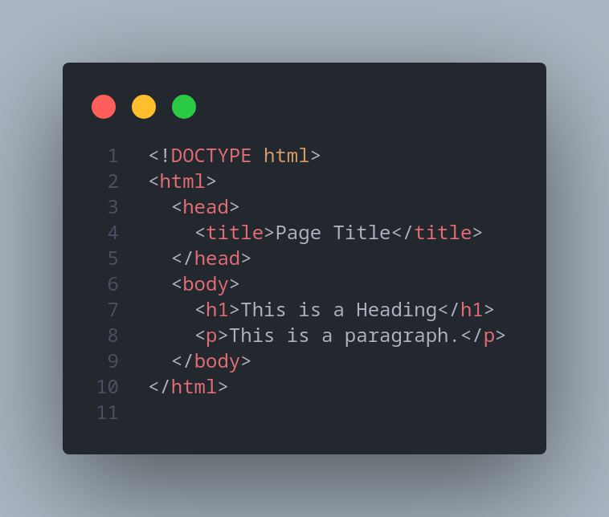
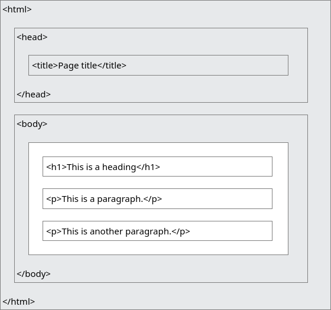
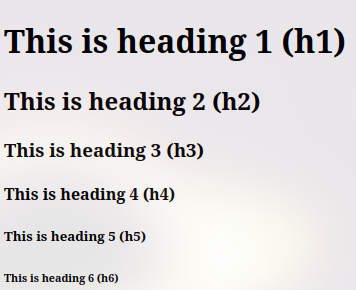
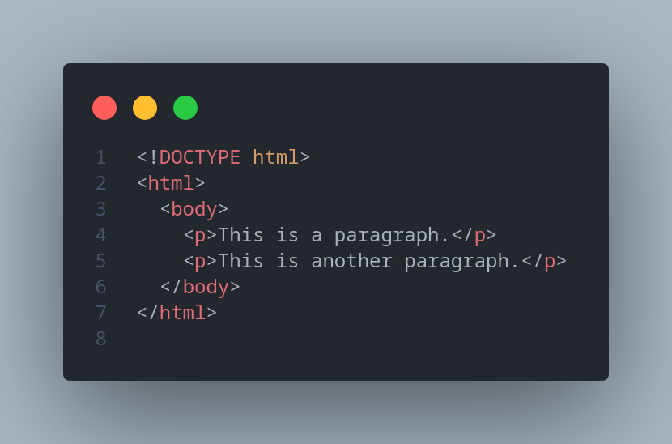
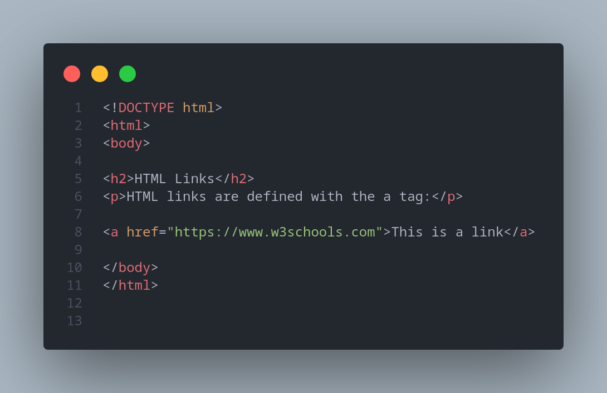
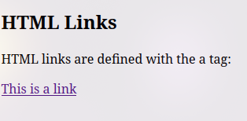
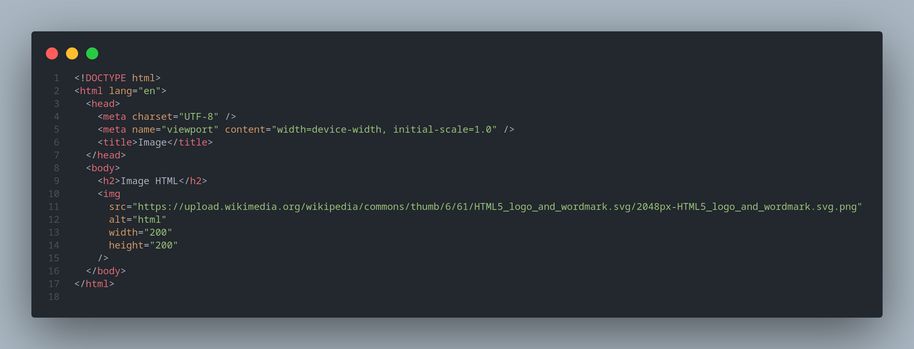

# Praktikum Pemograman WEB-1

## HTML

HTML adalah kepanjangan dari **Hyper Text Markup Language**, markup language adalah bahasa komputer yang menggunakan tags atau tanda yang akan diterjemahkan komputer menjadi sebuah tampilan web.

### Struktur HTML

- &lt;!DOCTYPE html&gt;: deklarasi yang menadakan bahwa dokumen ini adalah HTML5.
- &lt;html&gt; : akar(root) dari halaman HTML.
- &lt;head&gt; : berisi informasi meta mengenai halaman HTML.
- &lt;body&gt; : container dari semua konten yang dapat dilihat seperti, heading, paragraphs, images, hyperlinks, tables, lists, dll.

Tidak semua HTML mempunyai content dan end tag, seperti &lt;br&gt;. Elements yang tidak mempunyai content sidebut empty elements.

## Basic HTML

### HTML Heading

HTML heading menggunakan tag dari &lt;h1&gt;(terbesar) sampai yang &lt;h6&gt;(terkecil)

### HTML Paragraphs

HTML paragraphs menggunakan tag &lt;p&gt;

### HTML Links

HTML link mengunakan tag &lt;a&gt; dengan atribut href untuk link destinasi.

### HTML Images

HTML Images mengunakan tag &lt;img&gt;, dan memiliki atribut src(source file), alt(alternative text), width(lebar) dan height(panjang).

## HTML Elements

HTML element terdiri dari start tag, content, dan end tag.

**&lt;startTag&gt; Content &lt;/endTag&gt;**

**&lt;h1&gt; Heading &lt;/h1&gt;**

**&lt;p&gt; paragraph &lt;/p&gt;**

### Nested element

Nested element atau element bersarang artinya elemen dapat berisi elemen lain. Contoh nya seperti elemen &lt;body&gt; yang berisi elemen-elemen lain yang akan ditampilkan pad website, seperti &lt;p&gt; dan &lt;h1&gt;.

## HTML Attributes

- Semua HTMl element can have attributes.
- Attributes memberikan informasi tambahan mengenai elemetnts.
- Attributes selalu diletakan pada start tag.
- Attributes biasanya menggunakan value seperti name="value".

### Contoh Attributes

1. href
